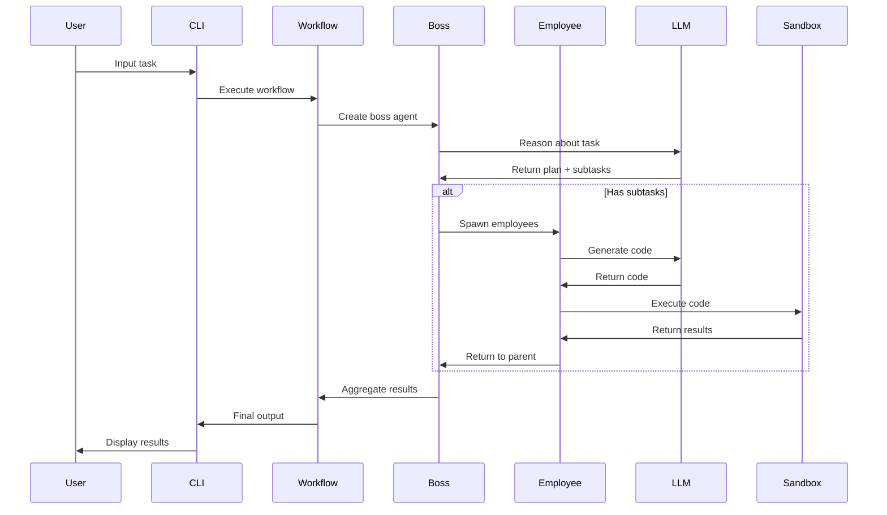

# Hydra Architecture Documentation

## Table of Contents
1. [System Overview](#system-overview)
2. [Core Components](#core-components)
3. [Data Flow](#data-flow)
4. [Agent Hierarchy](#agent-hierarchy)
5. [Technical Design](#technical-design)
6. [Security Architecture](#security-architecture)
7. [Deployment Architecture](#deployment-architecture)

## System Overview

Hydra is a hierarchical multi-agent system designed for autonomous code generation and task delegation. The architecture follows a tree-based hierarchy where agents can spawn child agents to handle subtasks.

```
┌─────────────────────────────────────────────────────────────┐
│                        Hydra System                         │
├─────────────────────────────────────────────────────────────┤
│                                                             │
│  ┌─────────┐    ┌──────────────┐    ┌─────────────────┐  │
│  │   CLI   │───▶│   Workflow   │───▶│     Agents      │  │
│  │ (Entry) │    │   Engine     │    │   (Hierarchy)   │  │
│  └─────────┘    └──────────────┘    └─────────────────┘  │
│       │                │                      │            │
│       └────────────────┴──────────────────────┘           │
│                          │                                 │
│                    ┌─────▼─────┐                          │
│                    │    LLM    │                          │
│                    │ (Claude)  │                          │
│                    └───────────┘                          │
└─────────────────────────────────────────────────────────────┘
```

## Core Components

### 1. CLI Layer (`src/hydra/cli.py`)
- **Purpose**: User interface for task input
- **Responsibilities**:
  - Parse command-line arguments
  - Handle multi-line input
  - Format output (text/JSON)
  - Exit code management

### 2. Workflow Engine (`src/hydra/workflows/engine.py`)
- **Purpose**: Orchestrate agent execution flow
- **Built on**: LangGraph state machine
- **Key Nodes**:
  ```
  Plan Node ──▶ Spawn Node ──▶ Aggregate Node
       ▲              │              │
       └──────────────┴──────────────┘
  ```

### 3. Agent System (`src/hydra/agents/base.py`)
- **Core Class**: `CodeAgent`
- **Key Methods**:
  - `reason()`: Task decomposition
  - `generate_code()`: Code creation
  - `execute_code()`: Sandboxed execution
  - `create_employee()`: Spawn child agents

### 4. Utilities (`src/hydra/utils/`)
- **Venice Client**: Fallback LLM integration
- **Config Management**: API keys and settings
- **Logging**: Hierarchical activity tracking

## Data Flow



## Agent Hierarchy

### Depth Limits
```
Level 0: Boss Agent
├── Level 1: Employee Agents
│   ├── Level 2: Sub-Employee Agents (MAX DEPTH)
│   └── Level 2: Sub-Employee Agents (MAX DEPTH)
└── Level 1: Employee Agents
```

### Parent-Child Relationships
- Each agent maintains reference to parent
- Parent tracks all spawned employees
- Bidirectional result passing
- Hierarchical logging with full ancestry

### State Management
```python
WorkflowState = {
    'task': str,           # Current task
    'depth': int,          # Current depth level
    'results': dict,       # Aggregated results
    'agents': list,        # Agent names
    'current_agent': str,  # Active agent
    'subtasks': list,      # Decomposed tasks
    'plan': str           # Execution plan
}
```

## Technical Design

### Class Hierarchy
```
CodeAgent
├── Properties
│   ├── name: str
│   ├── parent: Optional[CodeAgent]
│   ├── depth: int
│   ├── agent_id: str
│   └── employees: List[CodeAgent]
├── Methods
│   ├── reason(task) -> Dict
│   ├── generate_code(prompt) -> str
│   ├── execute_code(code) -> Dict
│   └── create_employee(subtask) -> Dict
└── Class Methods
    └── _setup_logger() -> Logger
```

### Workflow Graph Structure
```
StateGraph
├── Nodes
│   ├── plan_node: Task decomposition
│   ├── spawn_node: Employee creation
│   └── aggregate_node: Result collection
├── Edges
│   ├── plan → spawn (conditional)
│   ├── plan → aggregate (conditional)
│   ├── spawn → aggregate
│   └── aggregate → END
└── Entry Point: plan_node
```

### Execution Pipeline
1. **Task Input** → CLI parsing
2. **Workflow Init** → State creation
3. **Planning Phase** → LLM reasoning
4. **Spawning Phase** → Employee generation
5. **Execution Phase** → Code sandbox
6. **Aggregation Phase** → Result synthesis
7. **Output Phase** → Formatted display

## Security Architecture

### Sandboxing Strategy
```python
subprocess.run(
    ["python", "-c", code_str],
    capture_output=True,
    text=True,
    timeout=30,  # Hard timeout
    check=False  # Don't raise on error
)
```

### Safety Mechanisms
1. **Recursion Guards**
   - Hard limit at depth 2
   - Exception on depth violation
   - Tracked in agent state

2. **Code Validation**
   - AST parsing before execution
   - Syntax validation
   - Import restrictions

3. **Execution Limits**
   - 30-second timeout
   - Subprocess isolation
   - No file system access

4. **Error Handling**
   - Retry logic (2 attempts)
   - Graceful degradation
   - Comprehensive logging

### API Key Management
```
.env (git-ignored)
├── ANTHROPIC_API_KEY
├── VENICE_API_KEY (optional)
└── USE_VENICE flag
```

## Deployment Architecture

### Local Development
```
Developer Machine
├── Python 3.11+ environment
├── Virtual environment (venv)
├── Local API keys (.env)
└── File-based logging
```

### Internal Deployment
```
Internal Server
├── GitLab CI/CD pipeline
├── Container runtime (future)
├── Centralized logging
└── Monitoring (future)
```

### Configuration Hierarchy
1. Environment variables (highest priority)
2. Local config files
3. Default configuration
4. Hardcoded fallbacks

### Logging Architecture
```
logs/
└── agent_activity.log
    ├── Timestamp
    ├── Agent hierarchy
    ├── Task details
    ├── Execution results
    └── Error traces
```

## Extension Points

### Adding New LLM Providers
1. Create new client in `utils/`
2. Update config system
3. Add to fallback chain
4. Update tests

### Custom Workflow Nodes
1. Define node function
2. Add to StateGraph
3. Update edges/conditions
4. Test state transitions

### Agent Capabilities
1. Subclass CodeAgent
2. Override key methods
3. Maintain interface contract
4. Add to agent registry

## Performance Considerations

### Bottlenecks
- LLM API calls (network latency)
- Sequential spawning (not parallel)
- Subprocess overhead

### Optimization Opportunities
- Async LLM calls
- Parallel employee execution
- Result caching
- Connection pooling

## Future Architecture Considerations

### Scalability Path
```
Current: Single Process
    ↓
Phase 1: Multi-threading
    ↓
Phase 2: Multi-processing
    ↓
Phase 3: Distributed (Celery/RQ)
    ↓
Phase 4: Kubernetes Jobs
```

### Monitoring Integration
- OpenTelemetry instrumentation
- Metrics collection
- Distributed tracing
- Performance profiling

### Storage Backend
- Current: In-memory + logs
- Future: PostgreSQL for state
- Redis for caching
- S3 for artifacts